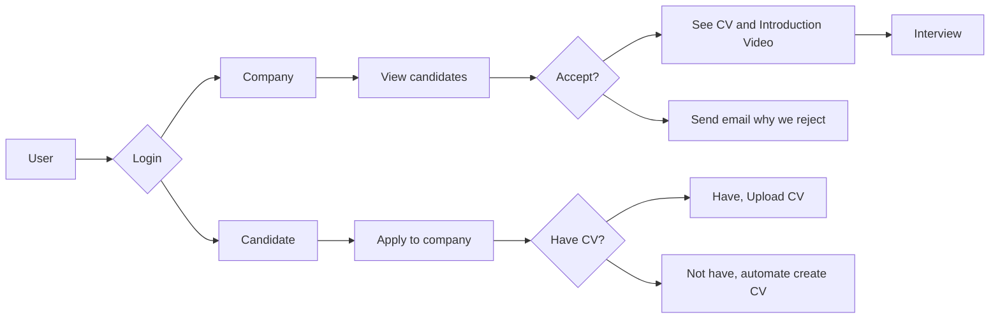

<h1 align="center">Interviewin API</h1>

## Introduction  

Interviewin is a platform for _Job Search_ portal for Candidates and Company can interact each other  

This is Backend service for interviewin, Created using [Golang](https://go.dev/) and for the database using [MySQL](https://www.mysql.com/)  

For the flow, bellow is the flowchart for the initial release  

