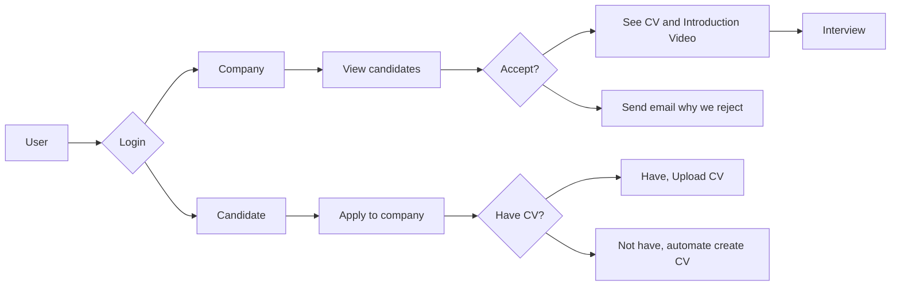
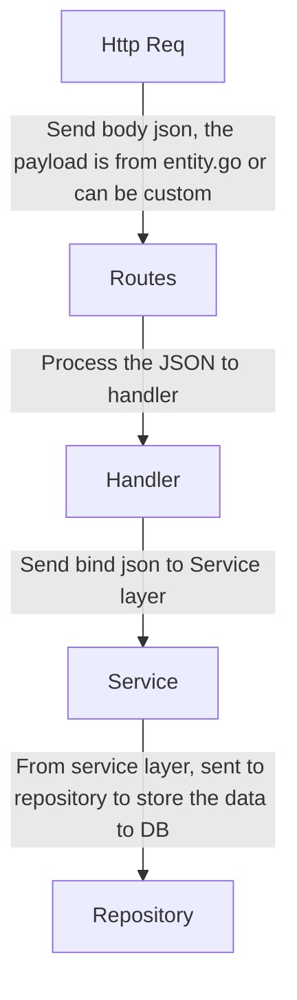

<h1 align="center">Interviewin API</h1>

## Introduction  

Interviewin is a platform for _Job Search_ portal for Candidates and Company can interact each other  

This is Backend service for interviewin, Created using [Golang](https://go.dev/) and for the database using [MySQL](https://www.mysql.com/)  

For the flow, below is the flowchart for the initial release  



For the File structure, can use template as declared below  

```
├── Candidate
|   └── entity.go `Model`
|   └── repository.go `Connect to database`
|   └── service.go `Business logic`
├── Company
|   └── entity.go `Model`
|   └── repository.go `Connect to database`
|   └── service.go `Business logic`
├── Config
|   └── db.go `Connection to mysql database`
|   └── env.go `Get value from .env file`
├── Handler
|   └── candidate.go `Handler for candidate`
|   └── company.go `Handler for company`
├── Routes
|   └── route_candidate.go `Router uri for candidate`
├── main.go `Initialize all stuff here`
```

For the flow of how the API structure works, down below is the graphic for the flow  


